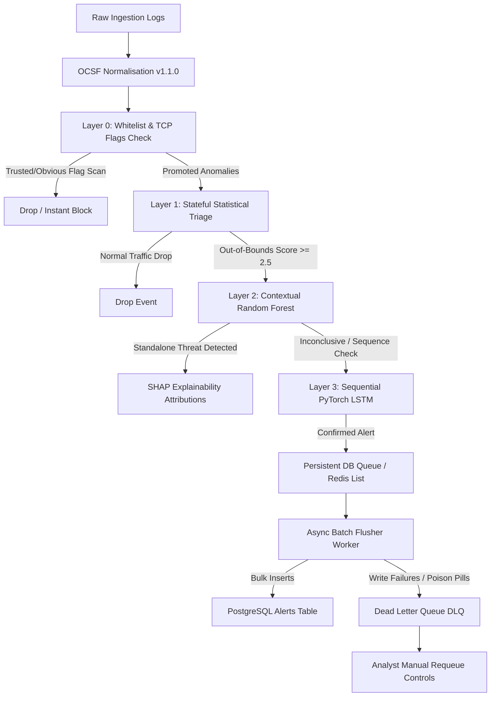

# OCSF ThreatPulse: Hybrid Threat Detection Pipeline & SOC Dashboard

A high-performance, tiered security telemetry ingestion and threat detection pipeline normalized to the **Open Cybersecurity Schema Framework (OCSF)**. The system couples stateful statistical triage, machine learning classifiers, and sequential deep learning sequence models with a real-time, Splunk-inspired SOC Analyst Dashboard.

---

## 🏗️ System Architecture

To minimize computational overhead and AI/ML evaluation costs, the pipeline routes streaming events sequentially through multiple gates:



### Ingestion & Normalization
* **OCSF Mapping:** Instantly parses and maps inbound network security streams to the standard **OCSF Network Traffic (Class 4001)** JSON schema.

### Sequential Detection Layers
* **Layer 0 (Deterministic):** Fast-passes local/DNS trusted IPs and fast-blocks basic TCP flag scans (Null, Xmas, SYN-FIN) in `<0.2ms` with `0%` ML compute.
* **Layer 1 (Statistical Triage):** Calculates rolling volumetric variations (EWMA), inter-arrival rates, and port Shannon entropy. Bypasses ML models for 90% of normal baseline traffic.
* **Layer 2 (Contextual ML):** A supervised Random Forest classifier that detects isolated threats (exploits, brute force) with high recall and computes **SHAP local feature attributions** for explainable threat indicators.
* **Layer 3 (Sequential DL):** A recurrent PyTorch LSTM tracking a chronological queue (sliding window of last 10 events per host) to catch slow beaconing sequences, lateral movements, and Advanced Persistent Threats (APTs).

---

## 📂 Repository Layout

```
task2/
├── config/             # Configuration settings and pipeline thresholds
├── data/               # Serialized ML model binaries and sample datasets
├── doc/                # Architectural diagrams and PDF/Word guides
├── frontend/           # Splunk-Inspired React 18 + TS + Vite SOC Dashboard
├── outputs/            # Training confusion matrices and performance reports
├── scripts/            # Utility helpers and PDF report generators
├── src/                # Core Python pipeline backend
│   ├── api/            # FastAPI REST endpoints and Pydantic schemas
│   ├── database/       # Async PostgreSQL flusher & Redis DLQ requeue logic
│   ├── features/       # Rolling stateful feature extraction pipeline
│   ├── ingestion/      # OCSF mapper and ingestion traffic simulator
│   └── models/         # Layered ML estimators (RF, LSTM) and train scripts
├── tests/              # Modular PyTest unit test files
└── verify/             # Level-based sanity and integration verify scripts
```

---

## ⚙️ Prerequisites & Setup

### Backend Environment Setup
1. **Python 3.10+** is required.
2. Install package dependencies:
   ```bash
   pip install -r requirements.txt
   ```
3. Initialize and train the machine learning layers (RF & LSTM):
   ```bash
   python -m src.models.train
   ```
4. Start the FastAPI API Server locally on port `8000` (defaults to in-memory fallbacks if Postgres/Redis are offline):
   ```bash
   python -m uvicorn src.api.main:app --host 127.0.0.1 --port 8000
   ```

### Frontend Dashboard Setup
1. Navigate to the `frontend/` folder:
   ```bash
   cd frontend
   ```
2. Install Node dependencies:
   ```bash
   npm install
   ```
3. Start the Vite React development server on port `5173`:
   ```bash
   npm run dev
   ```

---

## 🚥 Local Verification & Simulation

To test the end-to-end integration:

1. **Run Unit Tests:**
   ```bash
   pytest tests/
   ```
2. **Stream Live Simulation Traffic:**
   Use the async traffic simulator to feed OCSF event records to the live API:
   ```bash
   python -m src.ingestion.simulator --dataset unsw --limit 200 --url http://localhost:8000/api/v1/detect --delay 0.05
   ```
3. **Inspect the SOC Command Center:**
   Access the dashboard at **[http://localhost:5173/](http://localhost:5173/)** to observe telemetry charts, alerts tables, SHAP attributions, and DLQ monitor controls updating dynamically.
