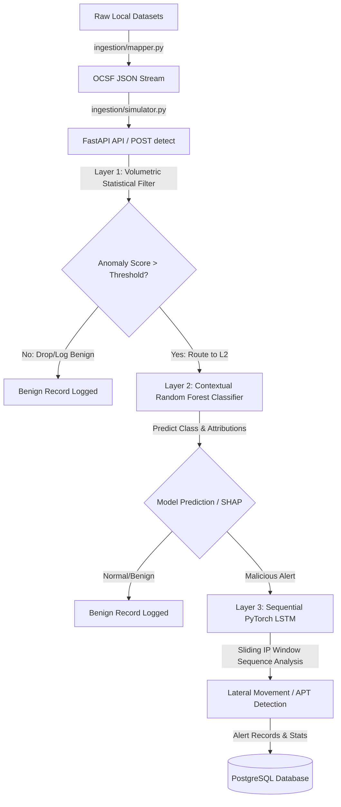

# Implementation Plan: OCSF-Based Hybrid Threat Detection Pipeline

Build a production-ready, modular, and high-throughput **Hybrid Threat Detection Pipeline** based on the Open Cybersecurity Schema Framework (OCSF) model. The system features a **3-Layer Tiered Defense Architecture** processing local security datasets (CICIDS2017, UNSW-NB15, CSE-CIC-IDS2018).

---

## User Review Required

We have identified architectural design choices for your review:

> [!IMPORTANT]
> **Data Imbalance & Volume Optimization:**
> The source datasets are extremely large (e.g., CSE-CIC-IDS2018 includes files >4GB). To prevent memory exhaustion and allow standard CPU execution, the training script (`train.py`) will load a configurable, class-balanced sample (e.g., 20,000 rows per dataset) from local folders, preprocess them, and serialize the models.

> [!NOTE]
> **Host IP Mapping Fallback:**
> CICIDS2017 and CSE-CIC-IDS2018 CSV exports from ISCXFlowMeter omit source and destination IP addresses to prevent classifiers from overfitting to specific host IPs. Since Layer 3 (LSTM) sequences events per host IP, the mapper will deterministically mock IP pairs based on hashes of port/protocol variables when true IPs are missing.

---

## Proposed System Architecture

The microservice will be organized as follows:



### Directory Structure

We will create the following corporate repository structure:

```
task2/
├── config/
│   ├── __init__.py
│   └── settings.py              # Configuration thresholds & DB URLs
├── deploy/
│   ├── Dockerfile               # Multi-stage production build
│   └── docker-compose.yml       # API & PostgreSQL container initialization
├── src/
│   ├── __init__.py
│   ├── api/
│   │   ├── __init__.py
│   │   ├── main.py              # FastAPI endpoints (/detect, /health)
│   │   └── schemas.py           # Pydantic schemas for input validation
│   ├── database/
│   │   ├── __init__.py
│   │   └── connection.py        # Asyncpg database connector
│   ├── features/
│   │   ├── __init__.py
│   │   └── pipeline.py          # Feature extraction & streaming logic
│   ├── ingestion/
│   │   ├── __init__.py
│   │   ├── mapper.py            # OCSF column normalizer
│   │   └── simulator.py         # Async simulator client (mock Kafka/queue)
│   ├── models/
│   │   ├── __init__.py
│   │   ├── estimators.py        # Layer 1, Layer 2 (RF/SHAP) & Layer 3 (LSTM) classes
│   │   └── train.py             # Offline training pipeline
├── README.md                    # Setup and execution guide
└── requirements.txt             # Python project dependencies
```

---

## Technical Specifications & Mathematical Logic

### 1. Layer 1: Volumetric Statistical Filter
Designed for low CPU overhead triage to block benign baseline traffic. It tracks state windows for three statistics:
- **Dynamic Z-Score ($Z$):**
  Calculated over the incoming flow rate $R_t$ within a window:
  $$Z = \frac{R_t - \mu_R}{\sigma_R}$$
  where $\mu_R$ and $\sigma_R$ are rolling event rate averages computed via Welford's algorithm.
- **Exponentially Weighted Moving Average (EWMA):**
  Tracks packet volume variations over time $t$:
  $$EWMA_t = \alpha \cdot X_t + (1 - \alpha) \cdot EWMA_{t-1}$$
  where $X_t$ is current flow byte/packet volume, and $\alpha \in [0.1, 0.3]$ is the smoothing factor.
- **Shannon Entropy ($H$):**
  Computed over the distribution of destination ports and protocols in the current window:
  $$H(X) = -\sum_{i=1}^n P(x_i) \log_2 P(x_i)$$
  Anomalies are detected if the combined score $S = w_1 |Z| + w_2 |EWMA - \mu| + w_3 (H_{base} - H_t)$ exceeds the configurable deviation threshold (default: $2.5\sigma$).

### 2. Layer 2: Contextual Random Forest Classifier
- **Model:** `RandomForestClassifier` with balanced class weights (`class_weight='balanced'`) trained on engineered OCSF features.
- **Explainability & Attributions:** When an alert is triggered (prediction = `1`), `shap.TreeExplainer` computes SHAP values on the feature vector.
- **SHAP Response Format:** Feature attributions must be formatted and returned in the API response under the `explanations` key as a list of objects:
  ```json
  "explanations": [
    {
      "feature_name": "fwd_bwd_bytes_ratio",
      "shap_value": 0.425
    },
    {
      "feature_name": "dst_port_entropy",
      "shap_value": 0.182
    }
  ]
  ```

### 3. Layer 3: Chronological Sequential LSTM
- **Model:** A PyTorch LSTM model (`hidden_size=64`, `num_layers=2`, `bidirectional=False`) designed for fast CPU inference.
- **State Tracking:** In-memory sliding deques store sequences of the last $N$ (default: $10$) events per unique host IP (`src_endpoint.ip` or `dst_endpoint.ip`).
- **Features:** Sequenced events feed sequence-level categorical OCSF class IDs, delta-times ($\Delta t = t_n - t_{n-1}$), and byte ratios.
- **Output:** Identifies APT beacon patterns, lateral progression, and sequential connection spikes.

---

## Component Details

### `config/settings.py` [NEW]
Contains environment configurations, logging levels, DB connection details, statistical filter weights, and detection thresholds.

### `requirements.txt` [NEW]
Lists all third-party libraries needed: `fastapi`, `uvicorn`, `pydantic`, `pandas`, `numpy`, `scikit-learn`, `torch`, `shap`, `asyncpg`, `motor`, etc.

### `src/api/schemas.py` [NEW]
Contains Pydantic v2 schemas representing the nested OCSF `network_traffic` structure for input validation. These schemas ensure that fields like `dst_endpoint.ip`, `dst_endpoint.port`, `connection_info.protocol_num`, and `traffic.bytes_in` are type-checked and validated at the boundary of the API.

### `src/ingestion/mapper.py` [NEW]
Standardizes the columns of the three datasets to OCSF `network_traffic` (class ID `4001`) JSON schema:
- Maps `Destination Port` / `dsport` / `Dst Port` to `dst_endpoint.port`
- Maps `Flow Bytes/s` / `sbytes` / `Flow Byts/s` to volumetric byte variables.
- Standardizes attack labels (e.g. `FTP-BruteForce`, `DDoS`, `Normal`, `Exploits`) into alert states and maps binary status to OCSF severity indices.

### `src/features/pipeline.py` [NEW]
Stateful streaming processor. Computes rolling window aggregations:
- $\Delta t$: time interval between consecutive flows.
- Rolling packet rates and forward/backward byte ratios.
- Destination IP variance and destination port entropy.

### `src/models/estimators.py` [NEW]
Contains the OOP interfaces for:
- `VolumetricStatisticalFilter` (Layer 1 state machine).
- `ContextualClassifier` (Layer 2 Scikit-Learn wrapper + SHAP explainer hooks).
- `SequentialThreatLSTM` (Layer 3 PyTorch model architecture and sequence generator).

### `src/api/main.py` [NEW]
FastAPI routing that exposes:
- `POST /api/v1/detect`: Ingests a single OCSF record validated using Pydantic, runs the 3-layer filter, stores threats in database, and returns the threat evaluation result (anomaly score, classification, SHAP explanations under the `explanations` key, LSTM status).
- `GET /api/v1/health`: Checks application and database connection health.

### `deploy/docker-compose.yml` [NEW]
Initializes the system:
- **`app` container:** FastAPI backend container.
- **`db` container:** PostgreSQL container with default settings to save events and alerts.

---

## Verification Plan

### Automated Testing & Offline Training
1. Run `python -m src.models.train` to sample raw CSVs, map to OCSF, train Layer 2 and Layer 3 models, and export `.pkl` and `.pt` weights.
2. Spin up the environment using `docker-compose up --build`.
3. Execute `pytest` or a local simulation script (`python -m src.ingestion.simulator`) to ingest logs asynchronously into the queue and hit `/detect` with valid OCSF records.

### Manual Verification
1. Verify database writes using PostgreSQL queries on table `threat_alerts`.
2. Inspect log outputs of the container to verify Layer 1 triages events, Layer 2 returns SHAP metrics in the required dictionary list schema under `explanations`, and Layer 3 outputs LSTM predictions for sequences.
